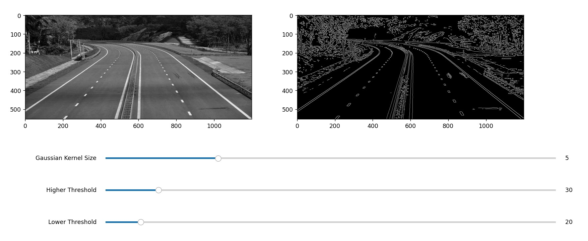
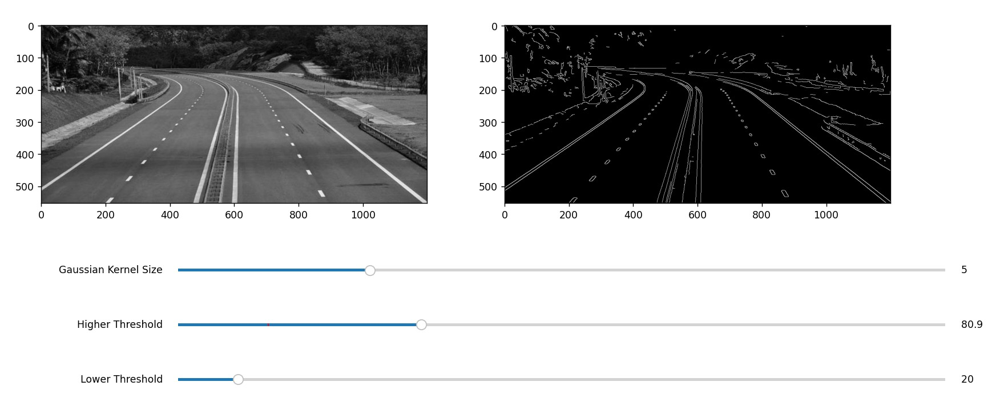
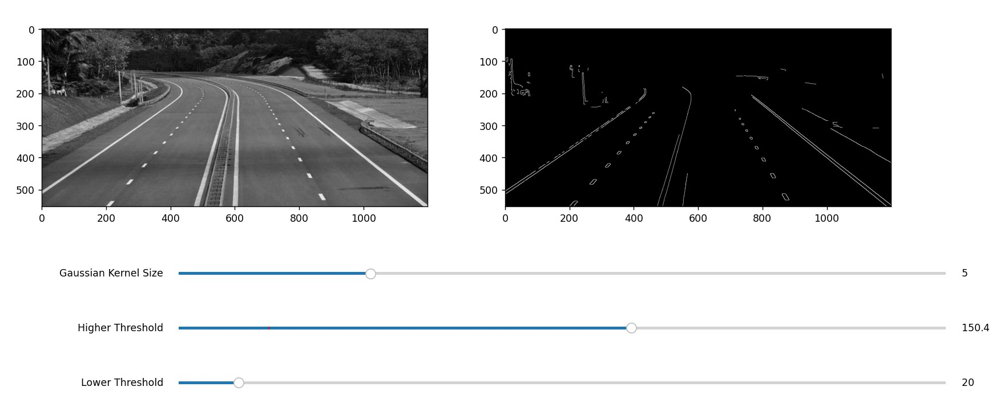

# Canny Edge Detector

This is the implementation of **Canny Edge Detector** from scratch using NumPy with interactive GUI in Python. Following are the steps:

1. Gaussian smoothing
2. Image Gradient: magnitude and direction
3. Non-Maximum Suppression: along gradient direction
4. Double thresholding
5. Edge selection by Hysteresis

**Sample Output 1:**

**Sample Output 2:**

**Sample Output 3:**

## Contributions
[Saurabh Chatterjee](https://github.com/chatterjeesaurabh)  
MTech, Signal Processing and Machine Learning  
Indian Institute of Technology (IIT) Kharagpur
